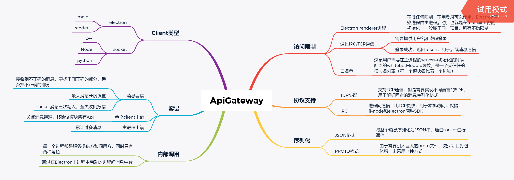

# ApiGateway  设计

## 1.项目说明

这是一个基于electron主进程的api管理框架。我们项目组对electron技术的使用较多，这个也算是经验的总结，经历过生产环境的考验。这个项目的所有代码和文档都是我个人完成，只是将框架的核心思想提取出来实现并开源。其实我并不知道是不是触犯了公司的规定，虽然没有使用公司的代码，但毕竟是借鉴了思想。

###  1.1 框架要解决的问题

首先说一下项目的组成，我们是一个以electron为核心的PC端项目，以安装包的形式发布版本。

####  1.1.1 项目现状

1. 进程数量多：其中带UI进程窗口40个以上，还有一些无UI的进程。
2. 进程实现的语言多：有electron的渲染进程，node进程，C++进程，python进程。
3. 进程之间通信方式多：进程并不是完全独立的，各个进程之间需要根据业务有通信交互，这些交互有些以IPC形式完成，如electron的渲染进程和主进程通过ipc通信；有些是通过本地开启的消息服务器通过订阅主题完成的，如C++进程通过内部的消息服务器与主进程通信。

####   1.1.2 问题

我们来看几个ipc通信场景，最复杂的是electron的渲染进程跟C++进程通信

1. electron渲染进程跟C++进程通信
2. electron渲染进程和主进程
3. C++进程和主进程
4. 主进程和node进程
5. node进程和electron渲染进程

原有的设计是这样，每次一个进程发消息给另一个进程都是通过electron主进程做中转。然后每次由于新的业务，都需要新加一条通信通道。所以每次新加一个条通信通道至少需要改动三个项目的代码（消息发起进程=> 主进程=> 消息接收进程），而且这仅仅是消息发送，如果要拿到消息请求的返回值仍然需要加一条新的通道。而且消息传递过程中出错，那么问题几乎无法定位。因为报错可能是发生在任何地方。发送端，中转端，接收端，甚至是消息处理报错。根据已有的方案我们可以总结出来以下问题：

1. 每次添加新的消息都需要去加新的通道，通道名，需要至少修改三个项目的代码。
2. 无法拿到消息请求的返回值。如果要拿到还要添加新的通道，过于复杂，而且即使通过新通道拿到了返回值，也无法通过js中，async/await的方式拿到返回值，类似于会将同业务的代码分散在不同的处理函数中。也就是说这里的返回值没有做到promise的封装。
3. 报错无法定位。如果一条消息没有被接收端处理，那么这个问题出在哪里呢？又是什么原因造成的呢？这个问题基本无法被定位，发送端，中转端，接收端，甚至是消息处理这些阶段都可能报错。如果要定位是需要同时启动多个项目联调的。
4. 如果只是一条临时消息，只用一次，那如何移除这个完整的IPC通道呢
5. 维护问题，这种设计，从代码角度根本无法看清这个项目是如何给外界提供接口的，其实我们站在一个独立项目的角度来看。如果外界想要调用我内部的功能，必然是我给外界提供编程接口，也就是API。而不是这种靠消息监听来调用我内部的功能。

有人可能会有个疑问，进程间通信，为何不是两个进程直连，非要通过electron的主进程做中转。这是个好问题，只是这个方案适合在进程数少的时候使用。举例来说，electron渲染进程跟C++进程通信，这种场景下，C++进程可以通过监听一个IPC的端口，然后定义与HTTP类似的上层解析协议，来完成数据交互。可是这样的话，我们也需要在渲染进程里面实现一套同样的消息解析协议，而且多个渲染进程之间，每个不同的渲染进程也都需要这样的规则，过于麻烦。不如交给electron主进程统一处理，而在electron应用之间使用electron自带的ipc工具。

### 1.2 框架功能

基于以上多个问题，我们设计了这套基于APIGateway框架，下图是框架提供的功能




##   2.使用教程

### 2.1 初始化参数

参数有两种形式options 或 string 。如果是options 则参数分为公用参数，server参数，client参数。如果是string，则该参数直接表示module

####  2.1.1 公共参数

1. `module` `string` 模块名，其他模块根据模块名调用该模块，options中的唯一必传参数。其他皆是可选参数。
2. `path` `string`使用一个 `path` 参数来识别 IPC 端点。 在 Unix 上，本地域也称为 Unix 域。 参数 `path` 是文件系统路径名。 在 Windows 上，本地域通过命名管道实现。路径必须是以 `\\?\pipe\` 或 `\\.\pipe\` 为入口。 会识别平台，默认给Windows `path`加上路径前缀，如果`port`和`path`都没有提供，则默认参数为`{path: 'apiGateway'}`
3. `port` `number` 如果是socket端口号
4. `host`  `string`主机ip地址, 默认localhost
5. `userName`  `string`需要登录时的用户名
6. `password`  `string`需要登录时的密码
7. `logger`  `function or Object`  如果是对象需要提供info,error,warn 三个方法用于输出日志，也可以提供任意一个，如果是函数则函数会接收info，error，warn三种日志输出。默认使用`console.log` `console.warn` `console.error` 输出日志

####  2.1.2 server参数

1. `whiteListModule` `array[string]`白名单列表，受信任的模块名`module`，所有electron的渲染进程都在白名单中
2. `supportSocket` `boolean`表示server是否开启socket监听，如果明确有`path` 或者 `port` 参数 该参数自动为true，默认false

####   2.1.3 client参数

1. `isWhiteListModule` `boolean` 该模块是不是白名单模块之一，该参数决定是否需要登录，非render进程，默认false。tip: moduleName必须在`whiteListModule`中，仅针对非renderer进程

###  2.2 初始化Server和Client

主进程的初始化，这是apiGateway的中转站，所有api请求都会经过这里，由于是基于electron主进程的，所以使用单例模式，这里初始化分为三种情况，主进程初始化，渲染进程初始化，已经node进程的client作为socket的初始化。如果有其他语言需要相关语言的sdk实现。即可接入apiGateway管理。

```js
import {createApiServer} from 'electron-api-manager'
// electron main 初始化
global.apiServer = createApiServer({
  module: 'ElectronMain', // 应用名称
    path: 'apiGateway' // 表示开始socket监听
})

import {createApiClient} from 'electron-api-manager'
// electron client 初始化
window.apiClient = createApiClient({
  module: 'ElectronRenderer1' // 应用名称
})

// node process 初始化,将实例挂载到全局对象上，可以在项目中任何地方调用。
global.apiClient = createApiClient({
  module: 'nodeProcess1' // 应用名称 内部根据process.type属性自动决定采用何种ipc通信方式。
})

// 其他语言，需要其语言实现相关的SDK，只需要监听path,或者端口号即可,然后处理对应消息。

```


###  2.3 注册Api

注册api方法是多端接口完全一致

```js
// 注册一个加1的方法，只需要一个apiName，和api对应的处理函数，该方法返回一个promise
const promise = global.apiClient.register('addOne', function(a) { return a + 1} )
promise.then(console.log,console.error) // 返回注册成功还是失败的回调
```


### 2.4 请求Api

```js
//参数 request
//  targetModuleName: 请求的目标应用名
//  targetApi: 请求的目标应用的api
//  params: 参数

global.apiClient.request('targetModuleName', 'targetApi', params).then((data) => {
  console.log(data, '目标应用返回结果')
}).catch((e) => {
  console.log(data, '请求异常')
})
//简便写法，requestByKey使用斜杠分隔
//  targetModuleName/targetApi: 请求的目标应用名/api
//  params: 参数

global.apiClient.requestByKey('targetModuleName/targetApi', params).then((data) => {
  console.log(data, '目标应用返回结果')
}).catch((e) => {
  console.log(data, '请求异常')
})
```

### 2.5 卸载 Api

```js
//参数
//mockApi: 要卸载的api

global.apiClient.destroy('mockApi').then((data) => {
  console.log(data, '卸载成功！')
}).catch((e) => {
  console.log(e, '卸载异常！')
})
```

## 问题

1. 客户端是否需要登录验证， token+白名单
2. socket断了怎么处理，token
3. 消息格式不正确如何容错，丢弃不完整消息
4. 同module支持多个api结果如何返回，返回其中一个结果
5. 如何支持重发消息，client：3次重试，server3次重试
6. 用户配置初始化
7. 客户端连接接口判断path还是port
